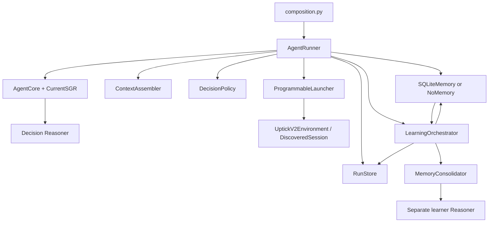

# Current agent architecture

## Components and dependency boundaries

The package is `uptick_agent`; `composition.py` selects concrete implementations.
Only Uptick v2 is shipped as a live environment adapter. Scripted implementations and
in-memory stores provide deterministic offline tests.

`AgentCore` knows shared values, the Reasoner interface and SGR. It receives an already
assembled context and returns a validated structured decision. It does not call tools,
query Memory, read traces or select concrete adapters.

`AgentRunner` owns sequencing, verification, persistence and failure handling through
ports in `core/contracts.py`. It has no simulator HTTP calls or SQLite queries.
Environment owns executable capabilities and state reduction; Memory owns retrieval
and revisioned writes; RunStore owns the audit record. Neither Environment nor Memory
imports the other. Reasoners do not import RunStore. Modules within one adapter family
may share implementation helpers. Architecture tests enforce dependency boundaries.

## Startup and operational lifecycle

1. Load and validate configuration, resolve the optional operator prompt, and require
   `live=True` before the live CLI constructs adapters.
2. `EnvironmentLauncher.run(spec)` creates the remote world with `POST /v2/start`.
   The Uptick adapter resolves the participant token from its configured environment
   variable and holds returned panel credentials inside the session.
3. Discovery reads `commands_markdown`, locates same-origin published API/catalog
   paths, compiles executable schemas, and asks the decision Reasoner to describe
   tool meanings and world completion fields. Those meanings are validated against
   the published catalog. A receipt stores the remote run ID without credentials.
4. `ProgrammableLauncher` wraps the discovered session with batch/program support.
   The bootstrapper loads or extracts an `EnvironmentBootstrapArtifact` from the
   instructions and authoritative capability catalog.
5. Resolve and pin Memory, then call the session's `start` to bind the exact profile.
   This does not issue another remote start. Write the initial manifest and `run_started`.
6. On each iteration: obtain current capabilities, recall Memory, assemble context,
   request a structured decision, validate policy and verification transitions,
   execute the selected capability, reduce state, and record `decision_trace`.
7. Close and optionally commit the previous decision's Episode when its assessment
   permits. Preserve pending verification across subsequent actions.
8. Continue until the environment is terminal or the configured local step limit is
   reached. Read the public result, finalize the manifest and operational stream,
   then optionally run after-run learning in a separate stream.

The model's completion flag alone does not finish the environment. A local decision
limit produces a forced result with the actual world status. An operational error
records `run_failed` and terminates the run; automatic resume is not implemented.

## Instructions and capability authority

The core prompt in `core/sgr.py` establishes general evidence, efficiency, verification
and context-retention principles. `environment.prompt_file` adds revisable operator
strategies for that environment. Published instructions supply the objective and
mechanics; neither operator guidance nor recalled experience grants new authority.
The manifest stores the consumed operator text. Discovery and learning do not receive
that operator prompt.

The executable catalog comes from the adapter, not from generated prose.
`Environment.bootstrap_capabilities()` defines the initial superset;
`capabilities(state)` supplies the currently available subset. Model-extracted
`ToolRegistry` descriptions are metadata. The provider sees compatible schemas, while
execution validates arguments against the complete original JSON Schema before HTTP.

Discovery supports OpenAPI 3 JSON/YAML, local acyclic references and the supported
command-catalog structure. Undocumented arbitrary URLs, remote schema references and
unsupported authentication schemes are rejected. Transport enforces same-origin paths;
session credentials are substituted only by the adapter and sanitized before evidence
is stored or passed to the model.

## Context and execution state

`AgentContext` contains the runtime objective, environment profile, environment state,
agent working state, recalled memory, capabilities, constraints and optional progress.
A generic runtime objective delegates concrete success conditions to the environment.

- `EnvironmentState`: the latest observation plus adapter-owned decision data. Historical
  snapshots retain their own timestamps; they are not assertions about current health.
- `AgentWorkingState`: the current strategy, one open decision and at most one compact
  closed-Episode bridge. It preserves commitments and verification criteria.
- `MemoryBrief`: selected Lessons with applicability/exceptions, similar Episodes and
  counterevidence. Recalled experience is not current world truth.
- `RunState`: private runner state, including the pinned Memory view and iteration.
  The runner never serializes it wholesale into a model request.

Context assembly preserves profile facts and Lesson conditions. Shared tool-schema
references avoid duplicate definitions; a reversible prompt projection avoids repeated
identical observations. This does not remove requested response fields.
Diagnostics, Git/config hashes, database revisions and retrieval IDs stay in manifests
and trace metadata rather than becoming decision instructions. Public evaluation fields
returned by the environment remain observable evidence.

The discovered session keeps the latest full sanitized response per capability, up to
six historical snapshots. Explicit `recent:<capability>` release can remove consumed
snapshots. Response arrays and strings are not truncated to meet a context budget.
A query can therefore still be expensive; scoped reads and release are decisions the
agent must make.

`execute_batch` accepts up to sixteen independent calls with known arguments. Execution is
sequential, validates the group before starting, reduces state after each call, and
stops on a failure. The result distinguishes completed, failed, unknown and unexecuted
work. Up to four retained batches preserve evidence until explicit release; one
transient batch can be replaced by the next transient result. Releasing evidence does
not cancel an operation. A queued response does not prove its asynchronous effect.

`execute_program` registers at most eight run-scoped programs. Each program calls one
primary capability and at most one conditional read-only follow-up. Nested calls use
current capability validation and state reduction. Programs cannot recurse, invoke
terminal/forbidden generic capabilities or persist through Memory. Selected output paths
and summaries form a bounded result; complete subcall evidence remains in the trace.
Programs have no separate shell, filesystem or arbitrary-network authority.

## Memory identity, retrieval and learning

SQLite/FTS5 stores revisioned Episodes and Lessons. `Memory.resolve_view()` pins database
identity and revision before the first decision; explicit writes advance the run's view.
An absent `learning` section makes memory frozen for that run. `NoMemory` supplies an
empty view. SQLite is a single-writer backend.

Exact bootstrap identity and memory compatibility are separate. The optional
`MemoryCompatibilityOwner` port returns a stable scope. Discovered environments derive
`contract-v1-…` from published instructions, API document, normalized command catalog
and discovery version, excluding generated descriptions. Recall, Episode IDs, evidence
grouping and consolidation all use that scope. `RunManifest.memory_profile_version`
records it when different from the exact environment profile used for replay.

A changed published contract gets a separate scope. There is no automatic cross-contract
transfer or implicit migration of historical records. Sessions without the port and
runs with explicitly pinned bootstrap artifacts retain their exact profile scope.

An Episode captures the original decision, facts, strategy, expected outcome and its
later assessment: confirmed, contradicted or inconclusive. Pending work keeps the
original decision open. Bounded evidence excerpts and trace references provide audit
provenance; complete operational traces are not copied into Memory.

Recall uses deterministic lexical search over the current observation, decision signals
and objective. Lessons and Episodes have separate candidate queries. Packing reserves
space for relevant Lessons, includes counterevidence and limits domination by one
world. The model receives a bounded brief, not the whole database. A recalled Episode
can replace the duplicate short-term bridge.

Learning uses closed Episodes and active Lessons supplied by Memory. It does not read
operational traces or require final scores as input. `MemoryConsolidator` calls a
separate configured learner, which proposes a Lesson or returns `no_lesson`.
Deterministic gates validate evidence membership, independent world groups, capability
names, scope, supersession and prohibited instance-specific material. Activation is
atomic and revisioned; it is not an independent proof that the Lesson is causally true.
Runs of the same world share an evidence group, so reruns do not count as independent
confirmation.

`after_run` finalizes the operational stream before consolidation and exposes new
Lessons to subsequent runs. `after_closed_episode` consolidates inline and requires
`min_evidence_groups: 1`. A learner failure does not rewrite a completed operational
result. An operational failure preserves earlier committed Episodes but skips after-run
consolidation. `no_lesson` does not mark its input Episodes covered.

## Persistence and replay

`JsonlRunStore` writes typed trace v6 with independent monotonic run/learning streams.
Historical v5 is readable; its extended result fields move into `result_details` on
read, while the shared result envelope remains validated. Mixed versions and writes
to old traces are rejected. New v6 results keep strict validation.
Operational events cover start, decisions, Episode close/commit, failure and finish.
Learning events cover start, proposal evaluation, activation, failure and finish.
Final events retain both the shared result envelope and full environment result details.

Manifests record exact profile identity, memory scope, model/config provenance and
metrics. The operational manifest ends before after-run learning; the linked learning
stream records its later revision. Source/registry caches and bootstrap artifacts speed
startup but do not reuse remote sessions or credentials.

`decision_corpus.py` projects saved traces into frozen decision contexts. Replay invokes
only AgentCore and Policy, with recorded prompt/schema guards. It does not call Memory
or Environment and cannot measure the quality of an alternative world trajectory.
Corpus schema v3 supports ordinary runs without an experiment spec: `export-corpus
--run-id` reads the saved manifest and run stream, preserving their actual provenance.
The alternative `--report` path validates links to a prepared experiment report.

`experiments.py` holds versioned saved-report values and offline aggregation/comparison
over published Uptick v2 score, cost and uptime. It does not infer profit or purchase
revenue. Historical profit-report schemas are rejected rather than reinterpreted.
The former live benchmark/comparison scheduler is removed: a fresh discovered catalog
includes generated descriptions and cannot reliably match an exact pinned bootstrap.
The generic runner's exact artifact validation remains intact; it is not bypassed to
make a live evaluation appear reproducible.

The local Trace Viewer reads artifacts without a backend. Its input is untrusted text;
it does not execute artifact content, fetch artifact URLs or persist uploaded data.

## Known limits

- Provider retry coverage is incomplete: some capacity errors terminate a run immediately.
- There is no operational checkpoint/resume or cross-run program persistence.
- Full requested responses can still make context large despite bounded history counts.
- Discovery descriptions and outcome assessments are model-generated; structural
  validation cannot guarantee their semantic accuracy.
- Memory retrieval is lexical; Lesson gates check evidence structure, not independent
  behavioral improvement. Evaluation must test frozen changes on held-out worlds.
- Environment contracts must remain compatible with the discovered capability superset
  throughout a run. Generic adapter ports are extension points, not additional shipped
  live environment implementations.
