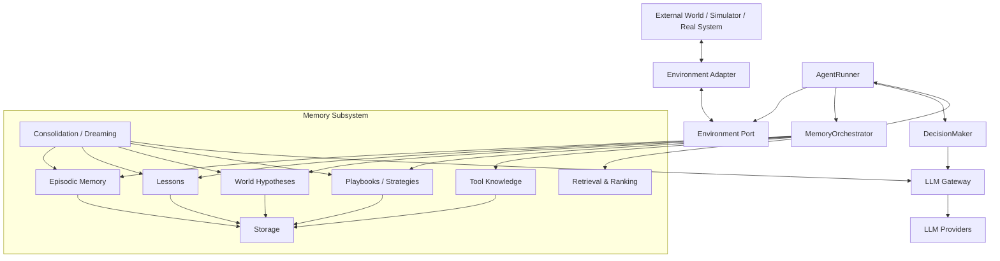
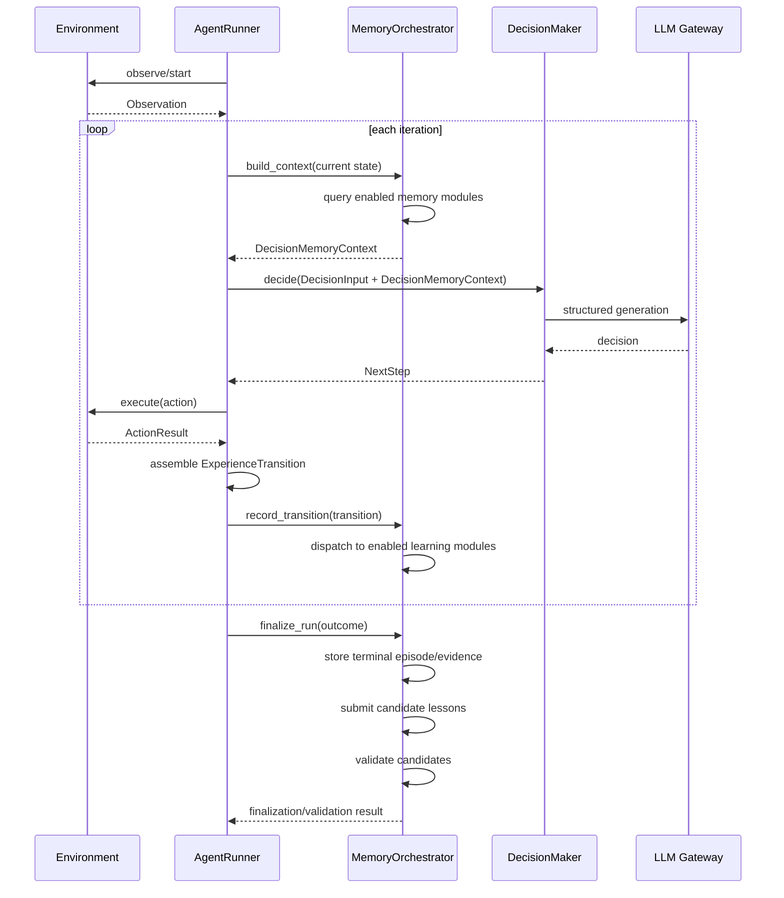
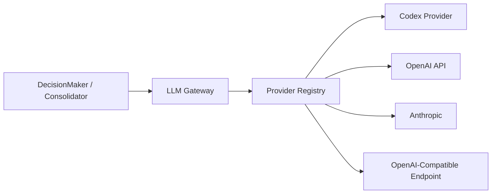
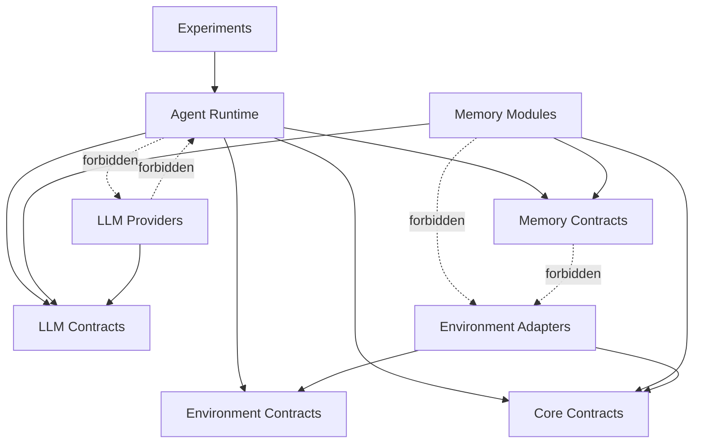

# RFC — Modular Cognitive Memory Architecture

Status: **Proposed**

## 1. Context

The current agent is intentionally compact. `AgentRunner` performs:

```text
recall → decision → environment action → remember
```

This is a good baseline but becomes unsafe to extend directly with lessons, world models, consolidation, retrieval policies and multiple LLM providers. If those concerns are inserted into `AgentRunner`, the runner becomes a god object and memory mechanisms become impossible to ablate cleanly.

The proposed change introduces explicit orchestration and module boundaries.

## 2. Architectural principles

Hard requirements:

- low coupling;
- high cohesion;
- dependency inversion;
- stable contracts at module boundaries;
- environment details do not leak into memory core;
- LLM provider details do not leak into reasoning or memory modules;
- optional memory features must remain optional;
- orchestration is composition, not domain reasoning;
- modules communicate through contracts, never by importing each other's internals;
- every important boundary gets an architecture test.

## 3. High-level architecture



Arrows between consolidation and memory modules denote calls through stable
capability contracts and orchestrator-managed composition. They do not permit
direct module imports or mutation of another module's store.

Important: **DecisionMaker does not call MemoryOrchestrator.**

`AgentRunner` controls the use-case flow.

### Trust and authorization boundary

Observations, tool results, retrieved memories and consolidated artefacts are
untrusted data, even when they come from an earlier successful run.

The memory subsystem must preserve source provenance and derivation links. It
must not interpret stored text as policy, grant capabilities, alter approval
rules, or expand the environment adapter's allowed action set. Learned content
is rendered to the decision model as data, not as higher-priority instructions.

Every prompt-facing memory item must use a fixed untrusted-data envelope that
carries its item ID, artefact type, origin module/version, transitive provenance
and trust classification. The renderer must keep memory content structurally
separate from system/developer policy, tool schemas and approval state.

The first implementation is authorized only for the simulator. A privileged or
production adapter requires a separate authorization and rollout design; the
adapter examples in this RFC do not constitute that approval.

Environment admission is deny-by-default. The resolved configuration and
experiment manifest identify the adapter ID and version, and the composition
root must reject any adapter not admitted by the active authorization profile
before an environment session starts or an action can be dispatched. The first
authorization profile admits only the approved simulator adapter.

## 4. Main decision loop



The runner knows **that memory exists**, but not which memory modules exist.

The decision maker knows only the stable `DecisionMemoryContext`.

## 5. MemoryOrchestrator responsibilities

The orchestrator is a **composition boundary**, not an intelligence layer.

It may:

- know which modules are enabled;
- validate module dependencies;
- dispatch lifecycle events;
- request retrieval from enabled modules;
- merge module outputs into a bounded context;
- expose instrumentation showing which modules contributed;
- invoke consolidation workflows through the explicit out-of-band command.

The first implementation has no automatic consolidation scheduler. Scheduled
or policy-triggered consolidation is post-v1 work and requires a separate
documented lifecycle decision.

It must not:

- contain simulator-specific rules;
- decide which operational action the agent should take;
- implement lesson extraction itself;
- directly depend on concrete stores or LLM providers;
- expose internal module data models to `DecisionMaker`.

It must also enforce the configured global item/token budget. Returning an
unbounded decision context is a contract violation, not an optional retrieval
strategy.

Suggested contract:

```python
class MemoryOrchestrator(Protocol):
    async def build_context(
        self,
        request: MemoryContextRequest,
    ) -> DecisionMemoryContext: ...

    async def record_transition(
        self,
        transition: ExperienceTransition,
    ) -> None: ...

    async def finalize_run(
        self,
        outcome: RunOutcome,
    ) -> None: ...

    async def consolidate(
        self,
        request: ConsolidationRequest,
    ) -> ConsolidationResult: ...
```

## 6. Stable decision contract

The decision layer should consume a normalized read model.

Example:

```python
class UntrustedMemoryEnvelope[T](BaseModel):
    item_id: str
    artefact_type: str
    origin_module: str
    origin_version: str
    trust_classification: TrustClassification
    provenance: list[ProvenanceRef]
    item: T


class DecisionMemoryContext(BaseModel):
    relevant_episodes: list[UntrustedMemoryEnvelope[EpisodeSummary]] = []
    lessons: list[UntrustedMemoryEnvelope[LessonView]] = []
    world_hypotheses: list[UntrustedMemoryEnvelope[HypothesisView]] = []
    playbooks: list[UntrustedMemoryEnvelope[PlaybookView]] = []
    tool_knowledge: list[UntrustedMemoryEnvelope[ToolKnowledgeView]] = []
    warnings: list[MemoryWarning] = []
```

This context is **not** the persistence model.

The persistence schema can evolve without changing `DecisionMaker`.

`DecisionMemoryContext` must always satisfy a configured hard size budget. The
orchestrator must use deterministic ordering and tie-breaking when it truncates
contributions. Item IDs, module/version, retrieval score, selection reason,
budget consumption and truncation decisions are recorded in a versioned
decision-memory trace outside the prompt-facing read model.

## 7. Module contract

Each memory module should have a narrow capability interface rather than inheriting one giant interface.

Examples:

```python
class ExperienceSink(Protocol):
    async def record(self, transition: ExperienceTransition) -> None: ...


class ContextContributor(Protocol):
    async def retrieve(
        self,
        request: MemoryContextRequest,
    ) -> MemoryContribution: ...


class ConsolidationParticipant(Protocol):
    async def consolidate(
        self,
        request: ConsolidationRequest,
    ) -> ConsolidationDelta: ...
```

A module implements only the capabilities it actually owns.

### Contract versioning, errors and idempotency

Every public serialized contract and persisted envelope carries
`schema_version` in `major.minor` form. A major increment is breaking and
requires an explicit migration/compatibility path; a minor increment is
additive and backward-compatible. Readers reject unknown major versions and may
ignore unknown fields from a supported minor version.

State-changing operations carry an idempotency key scoped to their operation
and input snapshot. Retrying the same key must have one logical effect and
return the original outcome or an equivalent persisted result. Typed errors
distinguish validation/configuration, conflict/concurrency, transient
infrastructure and permanent failures. Only transient failures are eligible for
bounded retry; validation, conflict and permanent failures require an explicit
caller decision.

Candidate promotion is a shared safety capability, not part of consolidation:

```python
class PromotionValidator(Protocol):
    async def validate(
        self,
        request: CandidateValidationRequest,
    ) -> ValidationManifest: ...
```

Lesson, world-model, playbook and tool-knowledge modules submit candidates to
this capability whether or not consolidation is enabled. It validates against
one immutable evidence snapshot and never generates the candidate it judges.
Only an accepted manifest may make a candidate decision-visible.

The initial simulator policy is `simulator-candidate-validation-v1`, version
`1.0`. A manifest is accepted only when it proves all of the following:

- support comes from at least two distinct completed eligible learning runs,
  identified by different logical `run_id` values in the declared immutable
  learning manifest; retries of one logical run do not count as independent
  support, and frozen-evaluation runs are never eligible;
- the support spans at least two immutable context IDs, where a context ID binds
  `environment_id` and `scenario_id`; a different seed or cosmetic parameter
  alone does not create a distinct context;
- every support and counter-evidence item has complete transitive provenance
  whose closure resolves inside the declared immutable evidence snapshot;
- the manifest includes every item returned by its named, versioned,
  deterministic counter-evidence queries; and
- `unresolved_contradiction_count == 0`.

Insufficient run or context support leaves the item `candidate`. Any unresolved
contradiction makes it `disputed`. A malformed manifest, incomplete provenance,
omitted known counter-evidence or an unknown/missing policy reference is a
validation error and leaves the prior non-decision-visible state unchanged.
The validator must not infer missing policy values.

This automatic authority applies only to individual memory candidates inside
the simulator. Changing an entire module from `experimental` to `default`
always requires recorded human approval in the promotion decision record.

## 8. Configuration and feature flags

Configuration controls composition.

Conceptual example:

```yaml
memory:
  compatibility:
    legacy:
      enabled: false
      status: experimental

  episodic:
    enabled: true
    status: experimental

  lessons:
    enabled: true
    status: experimental

  world_model:
    enabled: false
    status: experimental

  playbooks:
    enabled: false
    status: experimental

  tool_knowledge:
    enabled: true
    status: experimental

  consolidation:
    enabled: false
    status: experimental

  context_budget:
    total_tokens: 4000
    per_type_tokens: {}

  retrieval:
    lexical: true
    structured: true
    semantic: false

candidate_validation:
  policy_id: simulator-candidate-validation-v1
  policy_version: "1.0"

audit:
  retention:
    policy_id: simulator-audit-retention-v1
    policy_version: "1.0"
    raw_content_and_snapshot_days: 90
    summaries: project_lifetime
    validation_promotion_approval_rollback_records: project_lifetime
  raw_content_storage:
    policy_id: simulator-raw-content-v1
    policy_version: "1.0"
    prompts: enabled
    observations: enabled
    decision_traces: enabled
    retention_policy_ref: simulator-audit-retention-v1@1.0
    mandatory_secret_handling: redact_or_reject
```

The first implementation defaults to a hard 4,000-token memory-context budget.
Per-type quotas remain configurable. Token estimation must be deterministic for
the selected provider/model, and the estimator identity/version is recorded in
the resolved configuration and decision-memory trace.

The global 4,000-token limit always wins. Per-type quotas are upper caps, not
reservations. Omitted quotas add no type-specific cap; unused capacity is not
reserved. Configured per-type caps may sum above the global limit, but selection
still stops at the global cap. Effective caps and every overflow/tie-breaking
decision are emitted in the resolved configuration and trace.

Each module config also carries `status: experimental | default`. A module with
`status: default` requires a valid `approval_record_id`; the composition root
rejects a missing, mismatched or unverifiable approval before module
construction. Experimental modules may be enabled only in explicitly labeled
development/experiment profiles and cannot support a default-promotion claim.

The simulator profile enables raw prompt, observation and decision-trace
bodies. Each class has an independent versioned configuration switch so a later
profile can disable new raw writes without changing contracts. Configuration
changes do not delete already-retained data. Before any enabled body is written,
credentials and secrets must be removed; when that check cannot complete, the
content write is rejected or quarantined without its body and a metadata-only
audit event is recorded. No configuration may permit secrets in a primary
store, snapshot, manifest, diagnostic, retry payload or backup.

`simulator-audit-retention-v1` retains raw prompt, observation and trace bodies
plus snapshots for at least 90 days after their producing run or experiment
completes. Experiment summaries and validation, promotion, approval and rollback
records remain for the project lifetime, meaning until formal project
decommissioning and an explicit archival or deletion decision. Holds for an
incident or legal purpose override every expiry, compaction and deletion path.
After the minimum period, deletion is allowed only under a versioned policy
approved by the project owner; hashes, tombstones and the authorizing decision
record remain auditable.

Raw provenance needed by a decision-visible candidate cannot be deleted merely
because 90 days elapsed. Before its evidence expires, the candidate must be
revalidated against retained evidence, demoted to a non-decision-visible state,
or have the required provenance retained for as long as the candidate remains
active.

Dependencies must be explicit.

Example:

```text
world_model requires:
  - episodic OR lessons

consolidation may consume and revise:
  - episodic
  - lessons
  - world_model

playbooks may consume:
  - lessons
  - world_model
```

Do not encode these requirements as hidden imports.

## 9. LLM abstraction

LLM access is another bounded subsystem.

Memory modules and `DecisionMaker` must depend on a provider-neutral contract.



Suggested capability-oriented interface:

```python
class LlmClient(Protocol):
    async def generate_structured(
        self,
        request: StructuredGenerationRequest[T],
    ) -> T: ...

    async def generate_text(
        self,
        request: TextGenerationRequest,
    ) -> str: ...
```

Provider implementations own:

- authentication;
- endpoint shape;
- Codex subscription mechanics;
- OpenAI/Anthropic request conversion;
- retry/rate-limit policy;
- provider-specific structured output mechanics.

Provider-specific request/response objects never leave `llm/providers`.

## 10. Environment abstraction

The current `Environment` port is directionally correct.

Environment adapters may translate:

```text
SimulatorResponse
   ↓
ToolResult / Observation
```

The adapter stops at the generic observation/result boundary. `AgentRunner`
owns transition construction and invokes a pure core
`ExperienceTransitionAssembler` with the previous observation/state, selected
action and generic result. The assembler imports neither simulator nor provider
types.

Memory core must never import simulator models.

The environment contract does not itself authorize an adapter. Adapter
registration and action dispatch are conditional on the deny-by-default
authorization profile defined above.

Environment-specific tool facts are stored by the generic tool-knowledge module
under an environment/adapter namespace. The adapter exposes stable tool
descriptors and observed results through environment contracts; the module may
persist and retrieve those records but must not import adapter implementations
or encode their business rules in core code.

Later adapters might wrap:

- Kubernetes;
- SSH;
- observability APIs;
- an e-commerce application;
- a browser;
- another benchmark.

These are compatibility examples only. They do not authorize execution against
those systems; production and privileged adapters require a separate
action-authorization and rollout review.

## 11. Proposed dependency direction



## 12. Mapping to current repository

Current seams that should initially be retained are shown below relative to
`src/uptick_agent/`:

```text
ports.py
  Memory
  DecisionModel
  Environment
  RunObserver

runner.py
  AgentRunner

memory/in_memory.py
memory/jsonl.py

llm/codex.py
llm/openai.py

simulator/*
```

Initial durable persistence is SQLite behind the store contract. The in-memory
store remains the reference contract-test implementation. Existing JSONL memory
is retained only as the legacy compatibility adapter and as an import/export
format; it is not the writable system of record for structured memory,
consolidation or snapshots.

Migration should be incremental:

1. introduce new contracts beside existing ones;
2. adapt old `Memory` implementation behind the distinct
   `compatibility.legacy` module;
3. move direct memory query construction out of `AgentRunner`;
4. introduce `MemoryOrchestrator`;
5. keep current behavior as a compatibility configuration;
6. only then add richer modules.

This gives a baseline configuration that should behave like today's agent.

## 13. Architectural anti-patterns

Reject a change if it creates any of these:

- `DecisionMaker` imports `WorldModelMemory`;
- `AgentRunner` has `if config.world_model_enabled`;
- lesson code imports simulator types;
- a memory module directly instantiates Codex/OpenAI;
- one module directly mutates another module's database;
- stored entities are passed directly into the LLM prompt;
- consolidation logic sits inside `AgentRunner`;
- provider-specific response objects cross the LLM boundary;
- disabling one memory module requires edits in several unrelated modules.

## 14. Definition of architectural success

We should be able to execute configurations such as:

```text
A: no memory
B: episodic only
C: episodic + lessons
D: episodic + lessons + world model
E: episodic + lessons + world model + consolidation
```

without changing the runner or decision-maker implementation.
