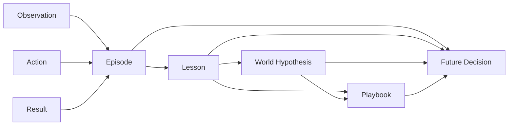
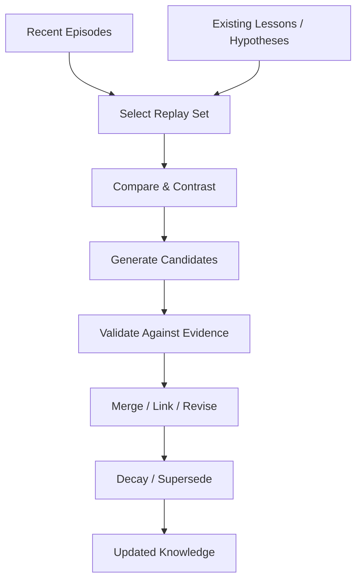

# Memory Model and Learning Lifecycle

## 1. Guiding idea

The system should not treat memory as one append-only list.

Different cognitive artefacts have different lifecycles, retrieval rules and confidence semantics.

The minimal conceptual model is:



## 2. Episodic memory

An episode records concrete experience.

Suggested generic fields:

```text
id
run_id
timestamp/range
pre_state summary
observation/evidence
action
result
objective_delta
cost
terminal flag
tags/features
links
source provenance
trust classification
schema version
experiment ID and phase
environment/scenario/seed identity
run attempt ID
source snapshot hash
```

An episode is evidence. It should not pretend to be truth.

Observation content is untrusted data. Provenance and trust classification must
survive summarisation, lesson extraction and consolidation so derived knowledge
cannot appear more authoritative than its evidence.

V1 trust classification is a closed enum:

```text
external_untrusted  — direct environment/tool content
derived_untrusted   — model- or rule-derived memory based on untrusted evidence
human_attested      — a human checked the cited evidence and claim
```

Trust classification is independent from lifecycle status such as `candidate`,
`active`, `disputed` or `superseded`. Even `human_attested` memory remains
prompt data: it never becomes system policy, changes approval state, grants a
capability or expands the adapter action allowlist.

Every derived artefact carries transitive provenance to retained source
attempts. Snapshot creation must reject an artefact whose ancestry cannot be
resolved to attempts admitted by the source experiment manifest and phase.

The simulator adapter may compute domain metrics such as money deltas, but the episodic core should model them generically as objective metrics.

## 3. Lessons

A lesson is a compact generalization extracted from one or more episodes.

Examples:

```text
Under condition X, action Y tends to improve outcome Z.
When symptom A follows event B, investigate B before applying expensive mitigation.
Action Y was ineffective in situations matching C.
```

A lesson should contain:

```text
statement
applicability conditions
supporting evidence ids
contradicting evidence ids
confidence
estimated utility
created_at
last_validated_at
status
source provenance
trust classification
schema version
```

### Anti-lessons

"Do not do X" should not require a separate architecture.

An anti-lesson is a lesson whose learned utility is negative or whose recommendation is avoidance.

Example:

```text
When latency is caused by a bad application deployment,
scaling backend instances repeatedly tends to increase cost without fixing availability.
```

## 4. World hypotheses

A world hypothesis tries to model causality or regularity beyond a direct action recommendation.

Examples:

```text
Some failures are release-dependent rather than capacity-dependent.
A deployment may have a delayed effect.
The observable error rate can lag behind the underlying incident.
```

Hypotheses are explicitly uncertain.

Suggested model:

```text
id
claim
scope
confidence
supporting_evidence
counter_evidence
related_hypotheses
status
created_at
updated_at
source provenance
trust classification
schema version
```

Statuses:

```text
candidate
active
disputed
superseded
rejected
```

Never silently overwrite a hypothesis after contradictory evidence. Preserve provenance.

## 5. Playbooks / strategies

A playbook is policy-like knowledge:

```text
IF situation matches conditions
THEN suggested investigation/action sequence
BECAUSE evidence/hypotheses
```

A playbook is not the actual agent plan.

The decision model may choose to ignore a retrieved playbook when current evidence differs.

This separation is important:

```text
world knowledge ≠ strategy ≠ selected decision
```

A playbook carries the same transitive provenance, trust classification and
schema version as its supporting lessons/hypotheses.

## 6. Tool knowledge

Tool knowledge describes how and when to obtain information or perform an operation.

Examples:

```text
get_deployments is useful for verifying recent release changes.
get_logs(status=500) exposes failing requests but can miss successful-path anomalies.
```

Tool knowledge must remain generic enough that replacing the environment adapter is possible. Domain-specific tool entries belong to the environment's learned knowledge, not to core code.

Each tool-knowledge item is namespaced by environment/adapter identity and
carries transitive provenance, trust classification and schema version. Stable
tool descriptors enter through the environment contract; the memory module does
not import adapter implementations.

## 7. Links and graph structure

Memory artefacts can reference each other using typed edges.

Useful edge types:

```text
derived_from
supports
contradicts
generalizes
specializes
caused_by
correlated_with
applies_to
supersedes
similar_to
used_by
```

Do not require a graph database initially.

Start with stable IDs and explicit link records. A graph DB can be an implementation detail later.

## 8. Retrieval

Retrieval should combine several signals.

Possible stages:

```text
1. hard filters
2. structured similarity
3. lexical/semantic candidate retrieval
4. relevance scoring
5. diversity/deduplication
6. context-budget selection
```

Useful structured features might include:

- action/tool type;
- incident category;
- outcome direction;
- environment features;
- temporal proximity;
- same-run vs previous-run;
- confidence;
- recency;
- importance;
- evidence count.

Vector similarity is useful, but should not become the only signal.

## 9. Memory context budget

More memory is not automatically better.

`MemoryOrchestrator` should produce a bounded context.

Minimum required policy shape:

```text
episodes: max N
lessons: max N
hypotheses: max N
playbooks: max N
tool knowledge: max N
total estimated tokens: max T (default: 4,000)
```

The configured total limit is a hard bound. Per-type limits may be configurable,
but selection and overflow behavior must be deterministic. The orchestrator
must record why each item was selected or dropped.

The initial default is 4,000 estimated tokens for the complete memory context.
The resolved configuration records the provider/model-specific deterministic
token estimator and its version.

This metadata is essential for later evaluation.

## 10. Learning lifecycle

### Online path

Fast and cheap.

```text
observe
→ act
→ record episode
→ update immediate statistics
→ retrieve for next decision
```

### End-of-run reflection

Medium-cost.

```text
run trace
→ identify important transitions
→ extract candidate lessons
→ connect outcome to earlier actions
→ record candidate knowledge
```

### Consolidation / dreaming

Potentially expensive and asynchronous.

In v1 it is started only by an explicit out-of-band command. There is no
automatic scheduler or implicit end-of-run trigger.

Generated lessons and hypotheses begin as `candidate`. They may not become
active merely because the same model generated and checked them. Promotion must
be bound to immutable evidence IDs, include discovered counter-evidence, and
produce an auditable validation result under the configured promotion policy.

Promotion uses a validator capability distinct from candidate generation. The
validator runs declared deterministic support and counter-evidence searches over
one immutable input snapshot and emits a versioned validation manifest with the
candidate hash, evidence content hashes, query/policy versions, grounding and
polarity results, support run/context IDs, provenance-closure result,
`unresolved_contradiction_count` and final disposition. Under
`simulator-candidate-validation-v1@1.0`, only support from at least two distinct
completed eligible learning runs with different logical `run_id` values,
spanning at least two immutable `(environment_id, scenario_id)` contexts, can
activate a candidate. Retries of one logical run are not independent and
frozen-evaluation runs are never eligible. Complete transitive provenance,
inclusion of all results from the declared deterministic counter-evidence
searches and zero unresolved contradictions are hard requirements. Insufficient
support leaves the item `candidate`; unresolved contradictions make it
`disputed`; either state remains non-decision-visible.



## 11. Contrastive replay

Randomly replaying memories is not necessarily useful.

Prefer strategically selected comparisons:

- same symptoms, different successful actions;
- same action, different outcomes;
- similar state, different world condition;
- older belief versus recent contradictory evidence;
- high-reward versus low-reward trajectories.

This gives the consolidator information that can distinguish causal rules from accidental correlations.

## 12. Delayed effects

A major learning problem is credit assignment.

An action may influence an outcome many steps later.

Do not solve this by storing only immediate `(action, result)` pairs.

Episodes should support:

- temporal links;
- operation IDs;
- causal candidates;
- delayed outcome attribution;
- later revision.

The first implementation can be heuristic rather than mathematically perfect.

## 13. Confidence

Avoid fake precision.

A simple transparent confidence model is preferable initially.

Confidence may depend on:

```text
number of supporting observations
number of contradictions
diversity of supporting contexts
recency
outcome magnitude
source reliability
```

The exact formula is experimental and should be replaceable.

## 14. Forgetting and compression

Forgetting is a feature.

Potential policies:

- discard raw low-value duplicate observations only after the applicable
  retention minimum and deletion authorization;
- retain summarized episode clusters;
- decay stale, never-retrieved knowledge;
- keep evidence for high-impact hypotheses longer;
- preserve contradicted knowledge as historical provenance when useful.

Compaction never overrides a legal/incident hold. Raw provenance for an active,
decision-visible candidate is retained beyond the normal 90-day minimum unless
the candidate is first revalidated against retained evidence or demoted.

A good memory system should have slower growth in decision-time context than in total experience.

## 15. What belongs outside memory

Memory does not own:

- the agent objective;
- execution of tools;
- simulator rules;
- current run control flow;
- LLM provider transport;
- benchmark scoring;
- operational policy selected for the current step.

Those belong to other bounded components.
