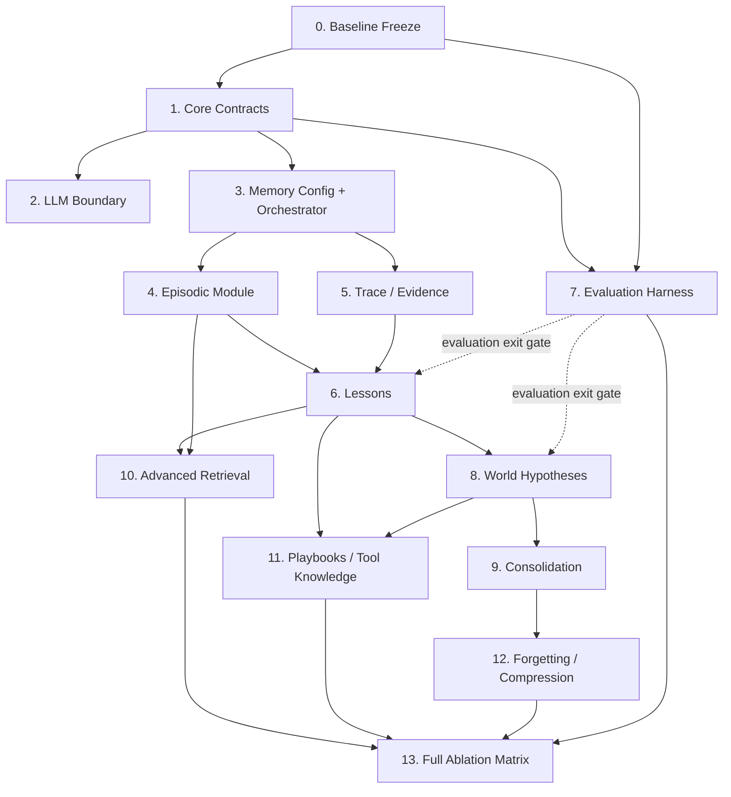

# Implementation Plan

## 1. Goal of this plan

Implement the architecture incrementally while preserving:

- a runnable baseline;
- clean boundaries;
- measurable behavior after every stage;
- ability to parallelize work across agents;
- ability to stop if a hypothesis is not useful.

Every stage has an outcome and an explicit reason.

## 2. Dependency graph

This graph is the recommended implementation sequence, not the runtime module
dependency graph. Runtime dependencies are declared by the configuration
contract in the RFC; for example, an alternative world-model implementation may
consume episodic evidence directly even though this plan builds lessons first.



## Stage 0 — Freeze the current baseline

### Why

Without a frozen baseline we cannot tell whether later complexity actually improved anything.

### Work

- record current config and dependency versions;
- define a fixed training seed set;
- define a separate evaluation seed set;
- pre-specify the complete B0/B1 comparison matrix using identical
  `(environment_id, scenario_id, world_seed, replicate_index)` blocks;
- capture no-memory and current-memory results;
- persist run traces and aggregate metrics;
- retain every attempt, including failed, interrupted and excluded runs;
- record a versioned experiment manifest before execution;
- snapshot and hash the initial and frozen memory states;
- compute per-metric distributions, variance and percentiles for
  `final_balance_minor` and every canonical guardrail;
- record source, dependency, environment, prompt, model, token-estimator and
  resolved-config fingerprints;
- document current architecture.

### Outcome

A reproducible baseline report.

The report is not complete unless it contains the paired run matrix, all
attempts, per-condition distributions, paired differences and the variance or
precision evidence needed to define the first promotion profile.

### Dependency

None.

### Parallel work

Can run in parallel with documentation.

---

## Stage 1 — Introduce core contracts

Status: **complete**. The accepted contract and review record is
[`STAGE_1_CONTRACT_FREEZE.md`](STAGE_1_CONTRACT_FREEZE.md).

### Why

Current `Memory` is intentionally simple. We need richer behavior without bloating that interface or leaking specific module types.

### Work

Introduce generic contracts for:

- `ExperienceTransition`;
- `RunOutcome`;
- `MemoryContextRequest`;
- `DecisionMemoryContext`;
- `MemoryContribution`;
- `ExperienceTransitionAssembler`;
- `ExperienceSink`;
- `ContextContributor`;
- `ConsolidationParticipant`.

Do not yet add smart learning.

### Outcome

The current agent can still run through compatibility adapters.

### Definition of Done

- current tests remain green;
- no simulator type exists in memory contracts;
- no LLM provider type exists in memory contracts.
- every public contract has required fields, types, invariants and ownership;
- serialized contracts and persisted envelopes have explicit schema versions;
- configuration has canonical defaults, dependency rules and a stable fingerprint;
- lifecycle, error, retry and idempotency behavior is documented;
- frozen-memory and persistence snapshot semantics are explicit;
- contract-level compatibility tests exist.
- the SQLite and in-memory stores pass the same contract suite;
- JSONL is explicitly limited to legacy compatibility and import/export.

No contract-dependent implementation beyond Stage 1 may start until this
contract freeze is complete. Design notes, experiment protocol work and
contract-independent harness scaffolding may proceed, but they must not invent
or consume provisional memory contracts. Naming a type without defining its
semantics does not satisfy this gate.

---

## Stage 2 — Stabilize the LLM boundary

Status: **complete**. See
[`STAGE_2_3_IMPLEMENTATION.md`](STAGE_2_3_IMPLEMENTATION.md).

### Why

We expect Codex subscription, OpenAI-style endpoints and potentially Claude/other providers. Learning modules must not care.

### Work

- define provider-neutral LLM contracts;
- adapt current Codex and OpenAI implementations;
- introduce provider registry/config;
- make structured generation a first-class capability;
- isolate provider-specific retry/auth/serialization.

### Outcome

Changing LLM provider is configuration, not architecture.

### Parallel work

Can proceed in parallel with Stage 3 once the Stage 1 contract-freeze gate is
complete.

---

## Stage 3 — Memory configuration and MemoryOrchestrator

Status: **complete**. See
[`STAGE_2_3_IMPLEMENTATION.md`](STAGE_2_3_IMPLEMENTATION.md).

### Why

Optional modules need a central composition point. Feature flags scattered through `AgentRunner` will destroy modularity.

### Work

- create memory module config schema;
- build orchestrator;
- dependency validation;
- module lifecycle registration;
- context contribution merging;
- per-module token/item budgets;
- diagnostics showing contributors.

### Compatibility configuration

```text
compatibility.legacy = current lexical Memory adapter
episodic = off
lessons/world_model/playbooks/tool_knowledge/consolidation = off
```

### Outcome

`AgentRunner` uses one memory orchestration interface.

### Definition of Done

There are no checks such as:

```python
if config.world_model_enabled:
```

inside `AgentRunner`.

In addition:

- the resolved config and its fingerprint are emitted to diagnostics;
- merge ordering, tie-breaking and budget overflow are deterministic;
- the global context limit is enforced on every path;
- a disabled module has zero construction, read, write, consolidation and
  context-contribution events.

---

## Stage 4 — First-class episodic memory

Status: **complete**. The implementation and verification boundary are recorded
in [`STAGE_4_IMPLEMENTATION.md`](STAGE_4_IMPLEMENTATION.md).

### Why

All higher learning depends on reliable evidence.

### Work

- convert raw observation/action/result to `ExperienceTransition`;
- construct transitions in `AgentRunner` through the pure core
  `ExperienceTransitionAssembler`; adapters stop at generic observations/results;
- persist explicit action and outcome structure rather than only serialized text;
- preserve run ID, ordering and timestamps;
- objective metric delta;
- links to operations when available;
- provide simple retrieval.

### Outcome

Structured history that can support causal analysis later.

### Parallel work

Can run in parallel with Stage 5.

---

## Stage 5 — Trace and evidence instrumentation

### Why

We need to inspect why a belief exists and why a memory was retrieved.

### Work

Record:

- memory items created;
- memory items retrieved;
- retrieval scores;
- module source;
- raw prompt and observation bodies plus complete trace event payloads when
  enabled by the resolved raw-content configuration;
- mandatory credential/secret redaction outcome for every attempted raw write;
- belief evidence links;
- final decision;
- run outcome.

The trace format must be versioned. For each decision it records candidate and
selected memory IDs, module/version, scores, selection rationale, budget use,
truncation, prompt inclusion, final action and outcome correlation IDs. The
initial simulator audit profile enables raw prompt, observation and
decision-trace bodies behind independent versioned `audit.raw_content` flags.
A disabled class persists no structured-audit body. These flags do not mutate
primary episodic/legacy records or their structured outcome semantics.
Credentials and secrets are removed before every persistence path; detection or
redaction failure rejects or body-less quarantines the write rather than falling
back to raw storage.

Every experiment and validation manifest references a versioned audit-retention
policy. `simulator-audit-retention-v1@1.0` keeps raw prompt, observation and
trace bodies plus snapshots for at least 90 days after run/experiment completion
and keeps experiment summaries plus validation, promotion, approval and rollback
records for the project lifetime. Incident/legal holds override expiry,
compaction and deletion. Deletion after the minimum period is permitted only
under a versioned policy approved by the project owner and leaves hashes,
tombstones and its decision record auditable.

### Outcome

Every learned artefact can be traced to evidence.

---

## Stage 6 — Lesson module

### Why

This is the first real compression/generalization layer.

### Work

- end-of-run candidate lesson extraction;
- lesson schema;
- evidence links;
- support/contradiction tracking;
- confidence;
- retrieval;
- deduplication/merge;
- negative-utility lessons ("anti-lessons").

At `finalize_run`, candidate lessons are submitted to the shared automatic
validator. Acceptance follows
`simulator-candidate-validation-v1@1.0`: at least two completed eligible
learning runs with different logical `run_id` values, at least two immutable
scenario/environment contexts, complete transitive provenance, no omitted
result from declared deterministic counter-evidence searches and zero unresolved
contradictions. Retries and frozen-evaluation runs are ineligible. Accepted
candidates become active for later runs. Insufficiently supported candidates
remain `candidate`; contradictory candidates become `disputed`; both remain
non-decision-visible. This simulator validation does not require human approval
for each memory item.

### Initial scope

Prefer transparent simple extraction over sophisticated autonomy.

### Outcome

Later runs can use generalised lessons, not only raw episodes.

### Evaluation gate

If lessons do not beat episodic-only memory on held-out seeds, investigate before adding more complexity.

---

## Stage 7 — Evaluation harness

### Why

Evaluation is not a final task. It is infrastructure required to decide what to build.

### Work

- named configurations;
- fixed train/eval splits;
- immutable frozen-memory snapshots identified by ID and content hash;
- isolated experiment/store/cache namespaces;
- paired runs of every condition on the same seed/scenario and replicate index;
- retention of failed, interrupted, retried and excluded attempts;
- aggregated metrics;
- memory-size/context-size metrics;
- LLM token/cost/time tracking;
- reproducible experiment metadata.

Before execution, persist a manifest containing the ordered run matrix, model
and prompt identity, source/environment versions, full resolved configuration,
budgets, failure/exclusion rules and the promotion profile being evaluated.

### Outcome

One command can compare variants.

### Parallel work

Experiment protocol design and contract-independent harness scaffolding should
start early. Contract-dependent Stage 7 implementation waits for the Stage 1
contract-freeze gate and can then run alongside Stages 2–6.

---

## Stage 8 — World hypothesis module

### Why

Lessons tell us what tends to work. World hypotheses should represent why/under what hidden regularity.

### Work

- candidate hypothesis generation from multiple lessons/episodes;
- support and counter-evidence;
- confidence;
- scope;
- contradiction handling;
- version/supersession links;
- retrieval into decision context.

### Outcome

The agent has an explicit, revisable world model.

### Gate

World-model-on must be evaluated against world-model-off.

---

## Stage 9 — Consolidation / dreaming

### Why

Cross-time pattern discovery should not live in the online decision loop.

### Work

- explicit consolidation command;
- replay selection;
- contrastive episode selection;
- lesson merge;
- hypothesis promotion/demotion;
- contradiction discovery;
- creation of new links;
- dry-run mode showing proposed deltas before commit.

In the first implementation consolidation runs only through an explicit
out-of-band command. It is never triggered implicitly by `AgentRunner` or
`finalize_run`.

Dry-run output is an immutable delta manifest. New knowledge remains
`candidate` and cannot influence decisions until the configured evidence and
promotion checks accept it.

Promotion validation is a separate capability from generation. It records the
immutable evidence snapshot, deterministic support/counter-evidence queries,
content hashes, grounding/polarity results, distinct completed eligible
learning-run IDs,
immutable context IDs, provenance completeness, omitted-known-counter-evidence
count, unresolved-contradiction count and policy version in a validation
manifest. Only a manifest passing every check in
`simulator-candidate-validation-v1@1.0` can activate a candidate.

The shared promotion capability is safety infrastructure, not an optional
consolidation feature. Lesson and world-model modules submit their candidates to
it even when consolidation is disabled, so A3/A4 remain functional. The
lesson module submits at end-of-run; other generators submit immediately after
creating a candidate. Candidates remain non-decision-visible until validation
completes.

An accepted validation manifest records the applicable policy checks and their
pass/fail results, acceptance status, policy/service authority or human
approver identity, timestamp, immutable decision-record reference and audit
retention-policy reference. Missing acceptance fields or a failed check prevent
activation.

Retries of the same logical run do not increase independent support, and
frozen-evaluation runs are excluded. Missing or malformed policy values are not
defaulted. Before raw
provenance supporting an active candidate can expire, the candidate is
revalidated against retained evidence, demoted, or its provenance retention is
extended.

Policy/service authority may activate individual validated candidates in the
simulator. It may not change a module-level status from `experimental` to
`default`; that transition requires recorded human approval.

### Outcome

Memory reorganizes itself outside the hot path.

### Safety property

Consolidation can be disabled without affecting normal read/write memory.

---

## Stage 10 — Advanced retrieval

### Why

As memory grows, retrieval quality becomes more important than storage volume.

### Work

Compare combinations of:

- lexical retrieval;
- structured filters/features;
- semantic embeddings;
- recency;
- confidence;
- diversity;
- graph-neighborhood expansion;
- learned/reasoned query formulation.

### Outcome

Retrieval becomes a replaceable strategy.

---

## Stage 11 — Playbooks and tool knowledge

### Why

Once evidence and world knowledge exist, the system can derive reusable policy-like artefacts.

### Work

Implement as separate modules:

- playbooks / strategies;
- tool knowledge.

Do not fold them into world hypotheses.

### Outcome

The decision maker can receive reusable strategies while retaining final control.

---

## Stage 12 — Forgetting and compression

### Why

Unlimited raw memory eventually hurts retrieval, cost and clarity.

### Work

- duplicate detection;
- episode summarisation;
- stale item decay;
- low-value deletion policies;
- superseded item handling;
- retention guarantees for high-impact evidence.

Retention and deletion follow the referenced audit-retention policy. Compaction
must not remove evidence or decision records under an active hold. It also must
not remove raw provenance required by an active candidate unless that candidate
was revalidated against retained evidence or first made non-decision-visible.

### Outcome

Long-running memory remains operationally bounded.

---

## Stage 13 — Full ablation matrix

Run the final matrix over held-out environments/seeds.

Example configurations:

```text
A0 no memory
A1 legacy lexical memory
A2 episodic
A3 episodic + lessons
A4 episodic + lessons + world model
A5 A4 + consolidation
A6 A5 + advanced retrieval
A7 A6 + playbooks
A8 A7 + tool knowledge
A9 A8 + forgetting
```

Do not assume the most complex configuration wins.

A module that adds complexity without measurable value should remain optional or be removed.

## 3. Parallelisation map

After Stage 1, work can split into independent streams:

```text
Stream A — runtime architecture
  orchestrator
  config
  module registry

Stream B — LLM subsystem
  contracts
  provider adapters
  registry

Stream C — evidence foundation
  episodic model
  trace instrumentation

Stream D — experiments
  train/eval split
  ablation runner
  reports
```

After Stages 4+5:

```text
Stream E — lessons
Stream F — retrieval experiments
```

After lessons stabilize:

```text
Stream G — world hypotheses
Stream H — playbooks/tool knowledge
```

## 4. Implementation rule for autonomous coding agents

Before starting a task:

1. read `00_NORTH_STAR.md`;
2. read the relevant section of `01_ARCHITECTURE_RFC.md`;
3. identify allowed dependencies;
4. state which module owns the change;
5. state which experiment validates it;
6. implement the smallest independently testable slice;
7. add architecture/boundary tests if a new dependency is introduced.

Do not opportunistically refactor unrelated modules.
