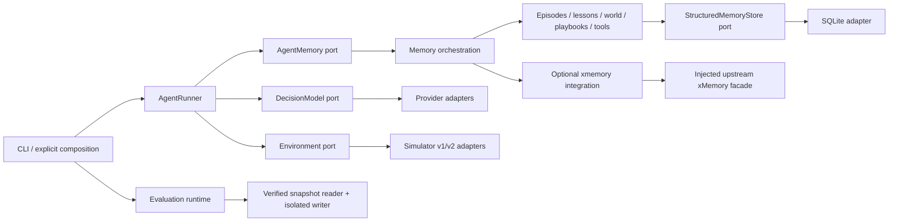

# Architecture and plan audit — 2026-09-05

The reviewed starting revision is `b3596cebb136bb2872c805dac527ca3f2407852b`.
This assessment distinguishes implemented contracts, operational checks and
measured agent effectiveness. It does not treat a large test suite or a large
memory catalog as proof of better decisions.

## Is the plan complete?

No. The optional experimental compositions A0–A9 execute, but the normative
end-to-end effectiveness plan is not complete.

| Area | Delivered | Still missing |
| --- | --- | --- |
| Stage 0 baseline | Frozen baseline tooling and versioned profiles | Original controlled B0/B1 balance evidence under a common simulator protocol |
| Stages 1–5 | Memory contracts, structured stores, orchestration, episodes and audit; import isolation repaired in this continuation | Broader use-case separation remains incremental; no concrete forbidden memory import remains |
| Stage 6 lessons | Independent validation and explicit provenance requirements | Held-out effectiveness; public worlds do not provide required immutable context identity |
| Stage 7 evaluation | Sealed manifests, isolated frozen inputs, retained attempts, telemetry and verification | A powered effectiveness study; integration coverage is a different claim |
| Stages 8–9 | World hypotheses and explicit consolidation | Live validated knowledge and causal/paired utility evidence |
| Stage 10 retrieval | Replaceable lexical/structured ranking, diversity and deduplication | Semantic embedding, graph and learned-query comparisons remain unimplemented alternatives |
| Stage 11 | Separate playbook and tool-knowledge modules | Controlled evidence that these improve decisions |
| Stage 12 | Retained-source compaction plans, holds, supersession and operational episode decay | Physical deletion and demonstrated long-running storage bounds |
| Stage 13 | Bounded A0–A9 plus four targeted configurations, 42 retained cells | Locked independent causal-family holdout, complete utility/uncertainty evidence and promotion/rollback decision |

The completed matrix had 41 horizon completions, one timeout and **zero SLO
passes in 42 attempts**. No live derived lesson/world/playbook/tool records
qualified for activation. Therefore this is not a comparison of successfully
learned policies. Details and exact historical source identities remain in
`V2_LIVE_INTEGRATION_RESULTS.md`.

## Concrete boundary defect found

Importing only `uptick_agent.memory.contracts` at the starting revision also
loaded configuration, consolidation, playbooks, tool knowledge, episodic and
lesson runtimes, and SQLite. The cause was eager package re-exports combined
with configuration imports from implementation modules. This made nominally
independent contracts transitively depend on implementation loading.

The existing architecture check inspected the early contracts/configuration,
stores and legacy compatibility paths. It did not recursively cover the later
memory modules or check actual import-time side effects. A direct-import check
alone could not detect the defect above.

The corrective scope is intentionally narrow: lazy compatibility exports,
implementation-independent settings contracts, recursive dependency checks and
fresh-process import isolation checks. Public import paths and historical
serialized configuration identities remain compatible: all four historical
sealed experiments pass the durable verifier after the configuration change.

The generic `EnvironmentSession` port supplies run and seed identity. A direct
runner outside evaluation may consequently record unknown environment/scenario
identity. This is a provenance limitation, not an observed activation bypass:
evaluation injects its pinned attribution, refuses learning declarations for
unverified world context, and validates evidence against immutable declarations.
Do not infer an immutable world identity from a run ID or seed.

## Is it a screaming architecture?

Partly. `memory`, `simulator`, `evaluation`, world hypotheses, consolidation,
playbooks and tool knowledge expose the application's concepts. The central
loop depends on `AgentMemory`, `DecisionModel` and `Environment`; memory crosses
its boundary as typed data with trust and provenance rather than provider
responses or simulator transport objects.

It is not a uniformly strict arrangement by use case. `models.py` combines
shared and versioned action/result types, and `evaluation_runtime.py` combines
lifecycle orchestration, durable artifacts, snapshot validation and default
memory composition. Those are maintenance hotspots. Renaming folders alone
would not improve their dependency boundaries or prove the agent works better.
`memory/lesson_runtime.py` is an explicit compatibility composition facade that
constructs episodic and lesson modules; `experimental_runtime.py` is the richer
experimental composition root. This deliberate migration exception should not
be copied into ordinary memory modules.

## External memory boundary

The assumed integration target is the local research library
`https://github.com/HU-xiaobai/xMemory`, not the separate hosted xmemory.ai
product. The user was asked to disambiguate; this assumption remains explicit.
Its adapter belongs in `integrations/xmemory`, outside memory contracts and
outside the simulator/provider adapters. It must normalize untrusted results,
retain source identity, redact data and participate in the same context budget.
It must not masquerade as legacy lexical recall or as independently validated
learned knowledge.

The upstream facade exposes no documented immutable snapshot contract.
Consequently live xMemory must not be admitted to frozen evaluation. Native
integration and frozen-evaluation admission are separate requirements.

## Validation and residual work

- Full offline suite: **524 passed, 2 skipped in 6.37s**. The two skips are
  opt-in simulator tests, not failures.
- A separate current live v2 adapter check passed: **1 passed in 3.14s**.
- After strengthening maximum-length journal key and reopened-SQLite finalizer
  checks, focused xmemory, architecture and CLI tests passed **31/31**.
- Ruff and changed-file formatting pass; all four historical sealed experiments
  still verify without artifact rewrites or manifest hash changes.
- The real upstream xMemory facade plus our adapter and SQLite passed a smoke
  with an injected fake memory system and stubbed heavy imports. The complete
  upstream model/embedding pipeline was not run.
- The final local quick review found no remaining actionable defect in the
  reviewed change. The architecture and effectiveness limits above remain.

Only source under `vadim/` was changed by this work. Sibling agent comparison
is recorded in `AGENT_COMPARISON.md`; a winner on task performance has not
been established.

The next useful work is to establish a successful observable-only SRE policy,
obtain authoritative world identities and lock a causal-family holdout, then
run a common-protocol comparison and memory-utility study. Semantic/graph
retrieval alternatives and policy-governed physical deletion remain separate
implementation work; adding them cannot substitute for those measurements.
