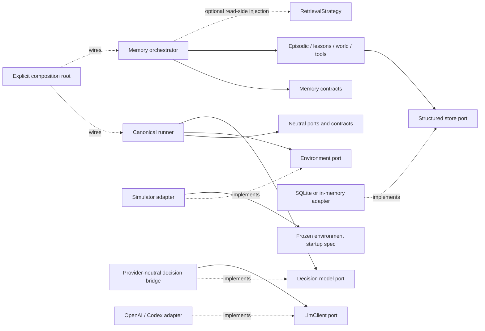

# Architecture hardening results

**Date:** 2026-09-05  
**Scope:** `vadim/src/uptick_agent` and its architecture tests

This document records the enforced dependency direction after the architecture
hardening pass. The checks are import and contract checks; they do not provide
a Python process sandbox, and they do not prove that an agent makes better
decisions.

## Enforced boundary matrix

The dependency direction is enforced by
`tests/test_memory_architecture.py`. Generic layers use an exact allowlist for
the few memory contracts they need. A new implementation under
`uptick_agent.memory` is denied until an explicit composition boundary is
reviewed.

| Layer | Owns | May depend on | Must not depend on |
| --- | --- | --- | --- |
| Memory contracts and stores contracts | Data shapes, provenance, validation and persistence ports | Pydantic, standard library, redaction and other neutral contracts | Simulator, environment adapters, LLM/provider code, integrations or SDKs |
| Canonical run, environment and decision runtime | The generic agent loop, ports and provider-neutral instructions | `ports`, neutral decision/environment contracts and the three generic memory contracts (`contracts`, `audit_contracts`, `compatibility.contracts`) | Concrete memory modules, simulator adapters or provider SDK adapters |
| LLM contracts, registry and structured decision bridge | Provider-neutral generation and schema handling | Decision/environment contracts and the `LlmClient` port | Concrete memory, runner, simulator and provider SDKs |
| LLM provider adapters | OpenAI/Codex transport | Provider-neutral LLM contracts and their SDK | Simulator, concrete memory and the runner |
| Simulator adapters | Environment HTTP translation, typed actions/results and public state | Simulator-local types plus neutral objective/operation contracts | Memory implementations, LLM/provider code and runner internals |
| Retrieval integrations | Optional embedding/reasoned-query adapters | Generic memory contracts and `retrieval_ports` | Simulator, provider adapters, concrete memory and SDKs in the neutral retrieval layer |
| xMemory integration | Translation to an injected external facade | Its explicit outer bridge: memory contracts, config, orchestrator and store contracts | Simulator, provider adapters and concrete memory implementations |
| Composition roots | Explicit selection and construction of real modules | All selected implementations and ports | Hidden construction in canonical contracts or the decision loop |

The memory boundary is checked across every Python file under the memory
package, not only its initial contract files. The non-composition checks cover
all files under `runs/`, `environment/`, `llm/`, `simulator/`, and the retrieval
and xMemory integration packages. Relative imports, `TYPE_CHECKING` imports,
and `from package import submodule` aliases are resolved before comparison, so
those forms cannot bypass the rule. A focused regression feeds the policy an
injected `from uptick_agent.memory import deletion, future_module` edge and
requires both implementation names to be rejected.

The import graph also has a runtime-edge cycle check. Fresh-process probes make
stable facades lazy: importing memory contracts or store contracts does not
load implementation modules, optional providers, simulator clients or the
xMemory integration. The configuration contract can be imported without
constructing or loading concrete memory modules.



## Environment-owned prompt and opaque tools

`decisions/instructions.py` owns one provider-neutral
`CORE_SYSTEM_PROMPT`. It contains no simulator or product vocabulary. The
environment contributes an explicit briefing through
`compose_system_prompt`; the briefing is appended as operating context, while
observations and recalled memory remain data rather than higher-priority
instructions.

`EnvironmentDecisionSpec` freezes the public decision surface for a run:
`response_model`, the environment briefing and the objective. Its response
schema is fingerprinted at startup and checked again before execution. The v2
adapter accepts the server's sanitized, non-empty `commands_markdown` as the
external startup document. When a caller supplied an expected briefing, a
mismatch fails closed; the adapter does not invent a local replacement when
the server omits the document. The typed `SimulatorV2Decision` and
`SimulatorV2Action` remain owned by the simulator adapter.

The runner sees only the generic `Environment` port. It asks for the frozen
decision specification, receives a structured decision, and calls
`validate_decision` before passing the typed action to `execute`. It does not
discover tools from observations or memory. The adapter owns the response
translation, credential removal, and sanitized public state copy. Public
state is evidence supplied by the environment; it does not become a hidden
memory or an assertion about simulator internals.

## Optional retrieval injection

`memory/retrieval.py` defines the small `RetrievalStrategy` protocol over
`ContextItem` and `MemoryContextRequest`. A
`MemoryModuleRegistration` can carry an optional strategy. The orchestrator
retrieves from the registered module first, validates the contribution, then
applies the strategy before its existing global merge, token estimator,
budget, and audit checks. The registration retains the original module object,
so adding a read-side strategy does not discard append, finalization or
consolidation capabilities.

The strategy may rerank, filter, deduplicate or apply explicitly configured
lexical/structured signals. It cannot invent, mutate or duplicate an admitted
envelope: the orchestrator snapshots the original envelope multiset and
rejects any ranked result outside that multiset. Provenance and trust fields
therefore remain authoritative. Disabled configuration leaves the strategy
absent, allowing composition to make zero strategy construction and calls.
The lexical baseline and structured matches are retrieval signals only; they
do not establish causal utility or learning effectiveness.

## Intentional compatibility and composition exceptions

These are narrow, named bridges. They are tested as exact exceptions rather
than broad subtree exemptions.

| Location | Exception and reason |
| --- | --- |
| `models.py` | Historical facade for Pydantic model imports and serialized qualified names. |
| `runner.py` | Historical runner facade delegates to `runs.execute` and adapts pre-spec environments. Its `simulator.legacy_state` import exists only for that old environment contract. New execution uses `runs.execute` directly. |
| `decisions/contracts.py` | Legacy `NextStep`/v1/v2 action schemas retain their historical simulator action and memory compatibility imports. The canonical `decisions/runtime.py` contract is provider- and simulator-independent. |
| `llm/prompts.py` | The old `V2_SYSTEM_PROMPT` and objective names lazily resolve `simulator.briefings`; the exact compatibility edge is allowlisted. The historical v1 prompt bytes remain in this facade. |
| `evaluation_runtime.py`, `experimental_runtime.py` | Compatibility constructors re-export canonical evaluation and composition implementations for existing callers. |
| `memory/compatibility/legacy.py` and `memory/lesson_runtime.py` | Explicit migration/composition facades preserve the legacy memory protocol and the ordered episodic-plus-lessons lifecycle. They are not imported by generic runtime contracts. |
| `evaluation/provenance.py` and `composition/*` | Outer validation and composition bridges load concrete memory implementations deliberately, after the generic ports have been crossed. They own wiring and phase checks. |
| `integrations/xmemory/adapter.py` | The outer adapter may use the explicitly listed orchestrator/config/store-contract bridge to register an injected `XMemoryFacade`. It does not import an xMemory SDK, simulator or concrete memory module. |
| `memory/jsonl.py` | JSONL remains a legacy import/export compatibility path. Structured stores do not use it as their backing store. |
| `llm/openai.py` and `llm/codex.py` | These are the only exact SDK import locations; SDK imports are not permitted elsewhere. |

The generic `EnvironmentSession` port intentionally exposes only generic
`run_id` and `seed`. A caller that runs outside the evaluation binding can
therefore have unknown environment/scenario provenance. The system keeps that
identity unknown and ineligible for activation; it must not synthesize an
authoritative world identity from a seed or run ID.

## Schema and verification evidence

`tests/fixtures/historical_schema_fingerprints.json` is a tracked fixture with
56 entries containing the original module, qualified name and canonical schema
SHA-256 from the pre-hardening baseline. The test fails if the fixture is
missing, an identity changes, or any schema hash changes. It does not regenerate
the baseline from current code or depend on ignored artifact directories.

Focused verification after the boundary change:

```text
.venv/bin/pytest -q tests/test_memory_architecture.py \
  tests/test_architecture_boundaries.py tests/test_memory_contracts.py
39 passed
.venv/bin/ruff check tests/test_memory_architecture.py
All checks passed
git diff --check
```

The checks establish import direction, lazy loading, contract identity and
the listed boundary behavior. They do not inspect dynamic imports or
reflection, do not establish a process-level security boundary, and do not
replace frozen evaluation, provenance validation, or empirical utility gates.
