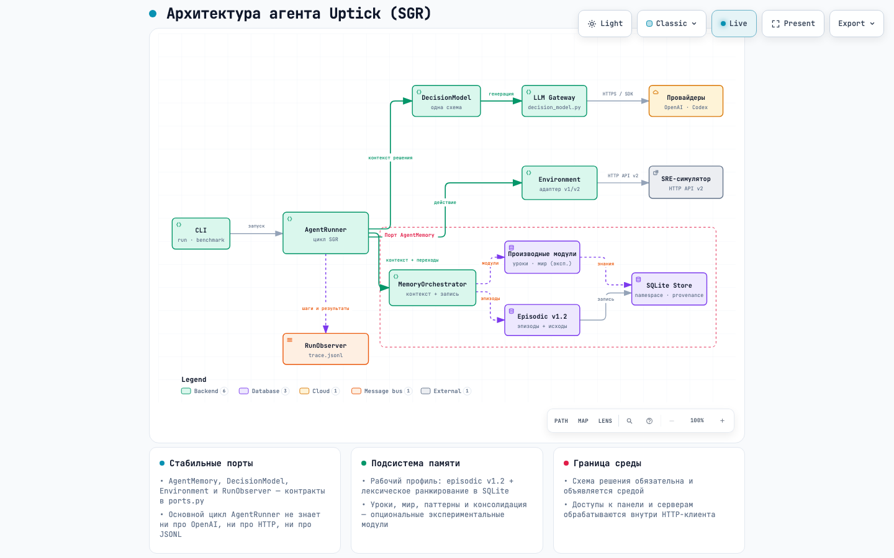
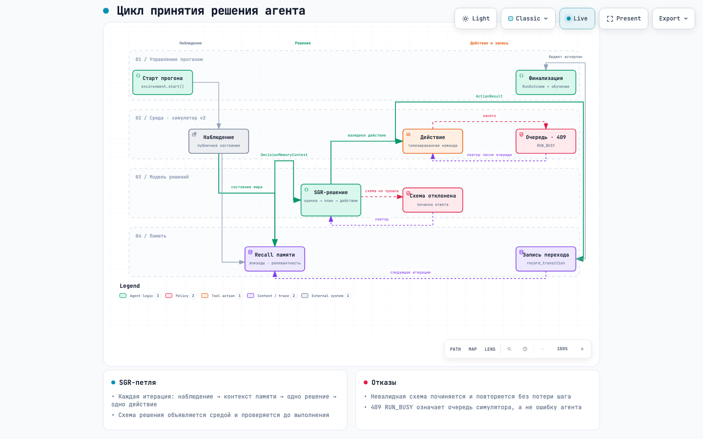
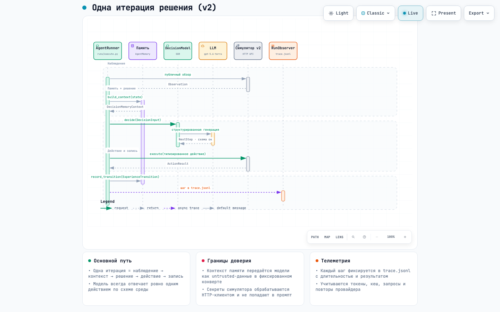
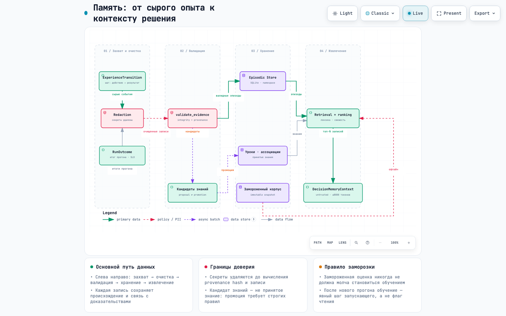
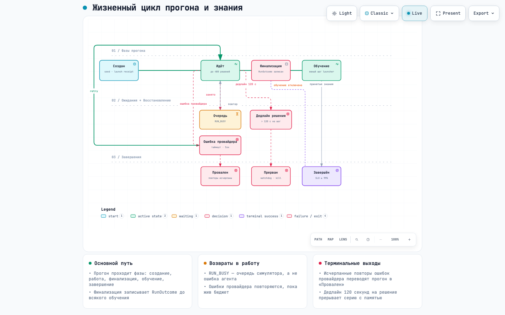

# Диаграммы агента Vadim

Пять представлений реализации агента. PNG доступны прямо на GitHub; HTML нужно
скачать и открыть в браузере для интерактивного просмотра. JSON содержит исходное
описание соответствующей диаграммы. Наличие модуля на схеме не означает, что он
включён в каждом профиле памяти.

| Диаграмма | Интерактивная версия | Исходное описание |
| --- | --- | --- |
| Архитектура | [HTML](architecture.html) | [JSON](architecture.json) |
| Цикл решений | [HTML](workflow-decision-loop.html) | [JSON](workflow-decision-loop.json) |
| Одна итерация решения | [HTML](sequence-decision-iteration.html) | [JSON](sequence-decision-iteration.json) |
| Потоки данных памяти | [HTML](dataflow-memory.html) | [JSON](dataflow-memory.json) |
| Жизненный цикл запуска | [HTML](lifecycle-run.html) | [JSON](lifecycle-run.json) |

## Архитектура

## Цикл решений

## Одна итерация решения

## Потоки данных памяти

## Жизненный цикл запуска

